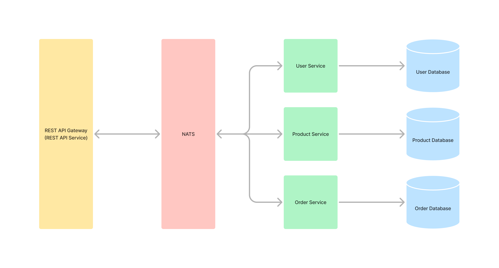

## NestJS + NATS Microservice

Research project for microservices



## Tech Stack

- NodeJS v20.x
- NestJS v10
- NATS
- Redis 7.4.1
- PostgresSQL 16.4

## Project setup

1. Copy .env.example to .env using `cp .env.example .env` then add require environment variables
2. Run `yarn install`
3. Create PostgresSQL databases name `nats_microservice_user`,`nats_microservice_product`,`nats_microservice_order`
4. Run migration `yarn db:all:migrate:run`
5. Run seed `yarn db:all:seed`
6. Run all applications `yarn dev:all` (watch mode) or `yarn start:all`

## Run project

```bash
# development
$ yarn run start <app_name>

# watch mode
$ yarn run start:dev <app_name>

# run all
$ yarn run start:all

# run all watch mode
$ yarn run dev:all
```

Available app: `user`, `product`, and `order`

## Database Commands

| Command                                                    | Description                           |
| ---------------------------------------------------------- | ------------------------------------- |
| `yarn db:<service_name>:migrate:generate <migration_name>` | Generate migration (on change entity) |
| `yarn db:<service_name>:migrate:run`                       | Run the migration                     |
| `yarn db:<service_name>:migrate:revert`                    | Revert the migration                  |
| `yarn db:<service_name>:seed`                              | Run the seeder                        |

Available service: `user`, `product`, `order` or `all` (`migrate:generate` and `revert` doesn't provided on `all`)

## Project Anatomy

```
.
├── apps/
│   ├── api/
│   │   ├── public/
│   │   │   └── user/
│   │   ├── src/
│   │   │   ├── app/
│   │   │   │   ├── auth/
│   │   │   │   │   ├── controllers/
│   │   │   │   │   ├── dto/
│   │   │   │   │   │   ├── requests/
│   │   │   │   │   │   └── responses/
│   │   │   │   │   └── services/
│   │   │   │   ├── order/
│   │   │   │   │   ├── controllers/
│   │   │   │   │   ├── dto/
│   │   │   │   │   │   ├── queries/
│   │   │   │   │   │   ├── requests/
│   │   │   │   │   │   └── responses/
│   │   │   │   │   └── services/
│   │   │   │   ├── product/
│   │   │   │   │   ├── controllers/
│   │   │   │   │   ├── dto/
│   │   │   │   │   │   ├── queries/
│   │   │   │   │   │   └── responses/
│   │   │   │   │   └── services/
│   │   │   │   └── profile/
│   │   │   │       ├── controllers/
│   │   │   │       ├── dto/
│   │   │   │       │   └── responses/
│   │   │   │       └── services/
│   │   │   ├── commons/
│   │   │   │   └── requests/
│   │   │   └── infrastructures/
│   │   │       ├── decorators/
│   │   │       ├── guards/
│   │   │       └── strategies/
│   │   └── test/
│   ├── order/
│   │   ├── src/
│   │   │   ├── app/
│   │   │   │   └── order/
│   │   │   │       ├── controllers/
│   │   │   │       ├── dto/
│   │   │   │       │   ├── replies/
│   │   │   │       │   └── requests/
│   │   │   │       ├── repositories/
│   │   │   │       └── services/
│   │   │   ├── database/
│   │   │   │   ├── config/
│   │   │   │   ├── entities/
│   │   │   │   ├── migrations/
│   │   │   │   └── seeders/
│   │   │   │       └── raw/
│   │   │   └── infrastructures/
│   │   │       └── guards/
│   │   └── test/
│   ├── product/
│   │   ├── src/
│   │   │   ├── app/
│   │   │   │   ├── category/
│   │   │   │   │   ├── controllers/
│   │   │   │   │   ├── dto/
│   │   │   │   │   │   ├── replies/
│   │   │   │   │   │   └── requests/
│   │   │   │   │   ├── repositories/
│   │   │   │   │   └── services/
│   │   │   │   └── product/
│   │   │   │       ├── controllers/
│   │   │   │       ├── dto/
│   │   │   │       │   ├── replies/
│   │   │   │       │   └── requests/
│   │   │   │       ├── repositories/
│   │   │   │       └── services/
│   │   │   ├── database/
│   │   │   │   ├── config/
│   │   │   │   ├── entities/
│   │   │   │   ├── migrations/
│   │   │   │   └── seeders/
│   │   │   └── infrastructures/
│   │   │       └── guards/
│   │   └── test/
│   └── user/
│       ├── src/
│       │   ├── app/
│       │   │   ├── auth/
│       │   │   │   ├── controllers/
│       │   │   │   ├── dto/
│       │   │   │   │   ├── replies/
│       │   │   │   │   └── requests/
│       │   │   │   ├── repositories/
│       │   │   │   └── services/
│       │   │   └── profile/
│       │   │       ├── controllers/
│       │   │       ├── dto/
│       │   │       │   ├── replies/
│       │   │       │   └── requests/
│       │   │       ├── repositories/
│       │   │       └── services/
│       │   ├── database/
│       │   │   ├── config/
│       │   │   ├── entities/
│       │   │   ├── migrations/
│       │   │   └── seeders/
│       │   │       └── loader/
│       │   └── modules/
│       │       └── queue/
│       │           ├── processors/
│       │           └── services/
│       └── test/
└── libs/
    ├── @common/
    │   └── constants/
    │       ├── di/
    │       ├── queue/
    │       └── rpc-patterns/
    │           ├── orders/
    │           ├── products/
    │           └── users/
    ├── @contract/
    │   ├── api/
    │   │   ├── requests/
    │   │   └── responses/
    │   ├── entities/
    │   │   ├── order/
    │   │   ├── product/
    │   │   └── user/
    │   ├── enums/
    │   ├── jwt/
    │   ├── pagination/
    │   └── rpc/
    │       ├── exceptions/
    │       ├── patterns/
    │       ├── replies/
    │       │   ├── order/
    │       │   ├── product/
    │       │   └── user/
    │       └── requests/
    │           ├── order/
    │           ├── product/
    │           └── user/
    ├── @infrastructure/
    │   ├── exceptions/
    │   ├── filters/
    │   ├── interceptors/
    │   ├── responses/
    │   ├── src/
    │   └── validations/
    ├── @util/
    ├── app-config/
    │   └── src/
    │       ├── configs/
    │       ├── constant/
    │       ├── providers/
    │       └── validation/
    └── dicebear/
        └── src/
            ├── constants/
            ├── esm_loader/
            ├── interfaces/
            └── providers/

```
